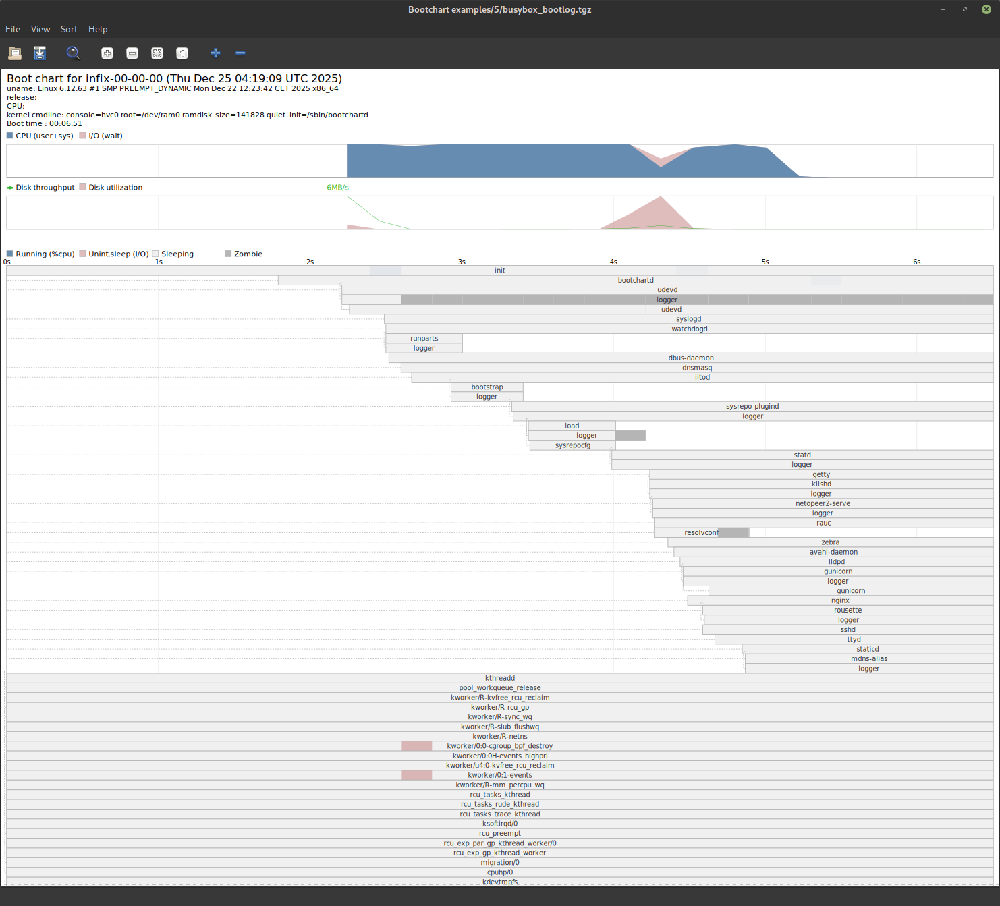

# InitViz

<a href="doc/initviz.png"></a>

Boot and init process performance visualization tool.

## Overview

InitViz visualizes system boot and init process performance by
collecting and rendering detailed timing data.  It consists of
two components:

- `bootchartd`: Data collector that runs during boot
- `initviz`: Interactive and batch visualization tool

## Quick Start

### Profiling Boot

Add to kernel command line (e.g., `/boot/grub/grub.cfg`):

```
initcall_debug printk.time=y quiet init=/sbin/bootchartd
```

After boot, data is saved to `/var/log/bootchart.tgz`.

> [!NOTE]
> The collector monitors `/proc/*/stat` and stops when it detects a login
> process (getty, gdm, kdm, xdm, etc.), configurable with `EXIT_PROC`.  After
> detection, it continues for `SETTLE_TIME` seconds (default: 2, configurable
> in `/etc/bootchartd.conf`) to capture post-login activity.

### Viewing Results

Interactive mode:

```bash
initviz -i /var/log/bootchart.tgz
...
```

Generate PNG:

```bash
initviz -f png -o bootchart.png /var/log/bootchart.tgz
...
```

> [!NOTE]
> Boot time is calculated as the end time of the last non-bootchart process,
> excluding the collector's runtime.  This accounts for services that start
> in the background after any of `EXIT_PROC` appears.

### Profiling Running System

```bash
bootchartd start
# ... do something ...
bootchartd stop
initviz -i /var/log/bootchart.tgz
```

## Features

- High-resolution timing (nanosecond precision via taskstats)
- Interactive viewer with zoom and pan
- Export to PNG, SVG, or PDF
- Process tree with CPU and I/O wait visualization
- Event annotation support
- Configurable process filtering

## Requirements

- Linux kernel with:
  - `CONFIG_PROC_EVENTS=y` - Process event monitoring (recommended)
  - `CONFIG_TASKSTATS=y` - Task statistics (required for detailed process data)
  - `CONFIG_TASK_DELAY_ACCT=y` - **Required for cumulative I/O charts**
  - `CONFIG_TASK_IO_ACCOUNTING=y` - I/O accounting (recommended)
- Python 3
- GTK 3 (for interactive mode)
- Cairo (for rendering)

**Note on cumulative I/O charts:**

The cumulative I/O chart requires `CONFIG_TASK_DELAY_ACCT=y` and only renders
when processes experience measurable I/O delays (blkio_delay_total or
swapin_delay_total > 0). Systems with fast storage or efficient I/O may show
zero delays, in which case no I/O chart is rendered.

## Installation

```bash
make
sudo make install
```

## Command Line Options

```
initviz [options] PATH

Options:
  -i, --interactive         Start in interactive mode
  -f, --format FORMAT       Output format: png, svg, pdf (default: png)
  -o, --output PATH         Output file or directory
  -n, --no-prune            Don't prune process tree
  -q, --quiet               Suppress informational messages
  -t, --boot-time           Display boot time only (text)
  --show-pid                Show process IDs
  --show-all                Show full process details
  --crop-after PROCESS      Crop chart after PROCESS starts
  --annotate PROCESS        Annotate when PROCESS starts
  --annotate-file FILE      Write annotation timestamps to FILE
```

## History

InitViz is a fork of [bootchart2](https://github.com/xrmx/bootchart) by
Riccardo Magliocchetti, which combined the original bootchart shell script
by Ziga Mahkovec with pybootchartgui by Anders Norgaard and Henning Niss,
and a C-based collector by Scott James Remnant and Michael Meeks.

## License

The visualization tool (initviz.py) is licensed under GPLv3+. The collector
(bootchartd) is licensed under GPLv2. See COPYING and individual source files
for details.
